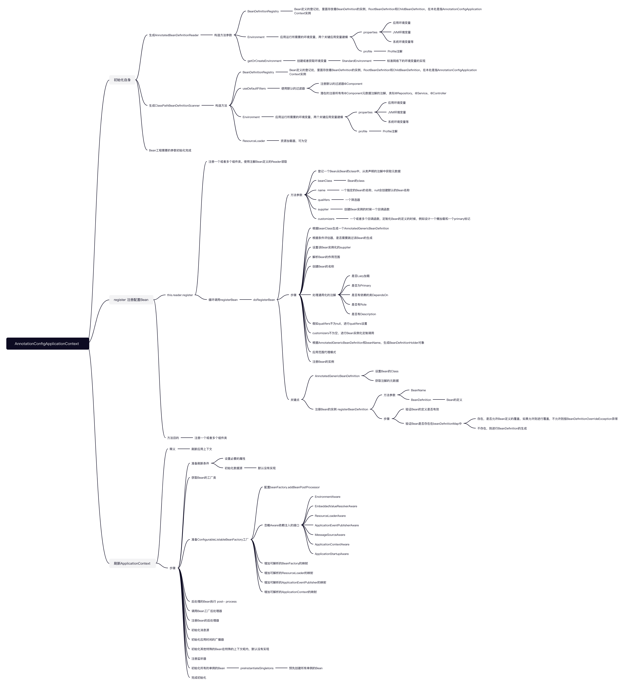

# 前言

Spring框架如今是Java开发生态必不可少的一个框架了，它有两个核心点，IoC和AOP。本文主要对Spring的IoC底层原理进行了解。

IoC俗称“控制反转”（Inversion of Control），或者是“依赖注入”（Dependency Injection）。刚开始接触这两个名词的时候肯定会有一些疑惑，我结合自身所认知的概念解释一下，在我们面向对象进行编码，我们所使用的方式，就是创建一个对象，将对象设置一些属性值，进行初始化。或者是对象中还引用其他对象的能力，进行引用对象的初始化，然后在set进我们所需要的那个对象中，或者是，使用一个静态工厂的方法，在工厂方法中进行对象的初始化。当我们每次调用的时候就可以获取到一个全新的对象了。读到这里，你会不会觉得这样的方式是十分冗余的，在编写我们的主要代码逻辑的时候，我们需要关注一些额外的东西，就是需要主动去关心，去操控这些对象的初始化操作，不断的重复这些创建，设置属性，设置依赖这样的循环。那么，我们所理想的状态应该是，有一个地方，它会给我所想要的对象，我不断的跟它去要这些对象，它会给我符合我要求的对象。这个地方就是所谓的对象容器，里面包含了开发者需要的各式各样的对象，它会去管理对象的生命周期，会去初始化对象所需要的值，对象之间所需要的依赖。这样以来，我们把自己主动操控对象的权利移交给了这个对象容器。我们不会再关心这些繁琐的操作。只需要一个指令，它就会给我们对应的对象。这就是所谓的控制反转。这里说个题外话，其实我们现在很火热的云原生（Cloud Native），也是带有这种控制反转的思想的。

这就是我所认知的控制反转，那么Spring Framework中，它是如何实现控制反转呢？

# Spring IoC流程

以下的思维导图是我以**AnnotationConfigApplicationContext**为基础，整理初始化Bean的容器的一整个过程，有些方法太过深入并且和理解Spring IoC的过程没有影响。所以就过多的去关注这些旁支逻辑了。（如果有错误的地方或者不足之处，欢迎评论区指正）

# 

首先，映入我们眼帘的是三个主核心逻辑

1. 初始化**AnnotationConfigApplicationContext**自身
2. **register**登记注册配置BeanDefinition
3. **refresh()**刷新应用上下文

我们就来详细看下这三步的详细关键点

## 初始化**AnnotationConfigApplicationContext**自身

关键步骤如下：

1. 生成**AnnotatedBeanDefinitionReader**对象，里面有三个参数**BeanDefinitionRegistry**：BeanDefinition的登记处，里面存放着BeanDefinition的实例，RootBeanDefinition和ChildBeanDefinition，在本处是指AnnotationConfigApplicationContext实例，**Environment**获取应用运行所需要的环境变量，包括应用环境变量，JVM环境变量，Profile注解等等
2. 生成**ClassPathBeanDefinitionScanner**对象，这个是XML形式的ApplicationContext使用到的，本文就不深入讲，其原理跟**AnnotationConfigApplicationContext**一样的。

这两个对象生成完成后，**AnnotationConfigApplicationContext**自身初始化工作已完成。

## register 注册Configuration Bean

**AnnotationConfigApplicationContext**可以接受一个或者多个Configuration的配置文件的Class对象，这部分的核心逻辑都在**AnnotatedBeanDefinitionReader.doRegisterBean**方法中，我们首先来看一下这个方法签名。

| 参数名称                                           | 参数说明                                                     |
| -------------------------------------------------- | ------------------------------------------------------------ |
| Class<T> beanClass                                 | 注册Bean的Class类                                            |
| @Nullable String name                              | 可选，注册Bean的名字                                         |
| @Nullable Class<? extends Annotation>[] qualifiers | 可选，设置Bean是懒加载，是否是Primary的Bean，是否是@Qualifier的Bean |
| @Nullable Supplier<T> supplier                     | 创建Bean完成后，初始化的回调函数                             |
| @Nullable BeanDefinitionCustomizer[] customizers   | 一个或者多个用于自定义的工厂BeanDefinition的回调，设置@Lazy，@Primary等 |

该方法的关键步骤如下：

1. 根据Bean的Class生成AnnotatedGenericBeanDefinition的实例
2. 设置Bean的Scope属性，生成Bean的名称（如果没有的话），进行通用化注解设置的处理（例如，@Primary，@Lazy，@DepensOn等等）
3. 根据Bean的名称和AnnotatedGenericBeanDefinition实例生成BeanDefinitionHolder
4. 设置@Scope的代理模式
5. 根据BeanDefinitionHolder实例，根据Bean的名称和BeanDefinition登记上去，Bean名称存在的话，进行覆盖（默认行为），Spring内部为beanDefinitionMap的ConcurrentHashMap的存放，Key为Bean的名称，Value为BeanDefinition实例（本文中是指BeanDefinitionHolder对象）

register 注册Configuration Bean的关键的整个过程。

## **refresh()**刷新应用上下文

这一步主要进行最终的初始化操作。主要流程如下

1. **prepareRefresh()**准备刷新条件，设置必要的属性（开始时间差，属性源，验证环境属性等）
2. **obtainFreshBeanFactory()**刷新内部的BeanFactory的对象（如果存在的话，会重新生成BeanFactory对象）
3. **prepareBeanFactory(beanFactory)**使用BeanFactory实例进行前置属性的设置，例如，依赖注入的时候忽略*Aware接口进行注入，要使用其实现类。例如BeanFactoryAware的BeanFactory，而不是BeanFactoryAware。将一些容器级的对象放入可解析的依赖中，类似ApplicationContext等等。
4. 进行BeanFactory的post pricess（后置处理），**invokeBeanFactoryPostProcessors**通过**PostProcessorRegistrationDelegate.invokeBeanFactoryPostProcessors**静态方法会将配置类的Bean方法中Bean生成BeanDefinition对象
5. 初始化**MessageSource**
6. 初始化**initApplicationEventMulticaster**
7. **onRefresh**初始化特殊的Bean在特殊的Context下
8. **registerListeners**注册监听器
9. **finishBeanFactoryInitialization**实例化所有的非懒加载的单例的Bean，
10. 完成刷新操作

核心的步骤就是第4步和第9步的步骤，加载完成后，整个Bean的容器就已经准备就绪了。可以提供使用了。

# IoC核心流程

通过梳理**AnnotationConfigApplicationContext**，我们了解到了Spring Bean容器的一整个加载实现，那么我们回顾前面梳理的步骤，将一些额外的步骤省略，毕竟Spring框架是企业级的开发框架，会增加很多额外的功能，我们暂时不关注这些旁支功能，关键整个创建IoC容器的核心步骤：

1. 首先将我们的配置类（@Configuration）生成BeanDefinition，放入BeanFactory的beanDefinitionMap内。
2. 将配置类内的Bean注解的方法生成BeanDefinition，放入BeanFactory的beanDefinitionMap内
3. 对所有的单例的Bean进行预实例化。

核心的步骤就是这三步，那么我们来实现自己的一个IoC容器。

# 动手IoC实现

## 定义BeanFactory

里面只有一个接口，根据Bean的名称去获取Bean

```java
public interface ActionBeanFactory {


    /**
     * 根据名称获取Bean
     * Get Bean according to name
     * @param name Bean名称
     * @return
     */
    Object getBean(String name);

}
```

## BeanFactory的实现类

```java
public ActionApplicationContext(Class<?> clazz) {
        try {
            registerBeanDefinition(clazz);
            preInstantiateSingletonBean();
        } catch (Exception e) {
            e.printStackTrace();
            throw new RuntimeException("Application init failed");
        }

    }
```

里面有两个核心方法

1. **registerBeanDefinition**根据配置类进行BeanDefinition的生成，并且生产内部@Bean注解的方法的Bean
2. **preInstantiateSingletonBean**对单例的Bean进行预先生成

## 测试

测试代码

```java
ActionBeanFactory beanFactory = new ActionApplicationContext(AppConfig.class);
MyServiceImpl myService = (MyServiceImpl) beanFactory.getBean("myService");
myService.introduce();
```

正常打印输出

```
It's a wheel design drawing for spring
```


该实战完整代码在我的GitHub仓库上：[项目地址](https://github.com/jackpan123/wheel-design-drawing-spring/tree/master/src/main/java/com/jackpan/spring/ioc/action)

# 总结

以上就是我们对Spring IoC的一次深入探究，希望大家能有所收获。

